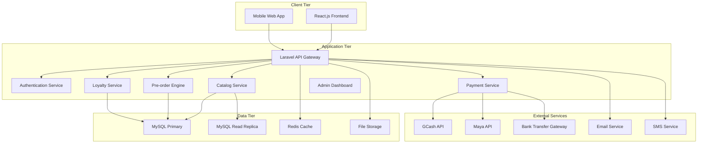
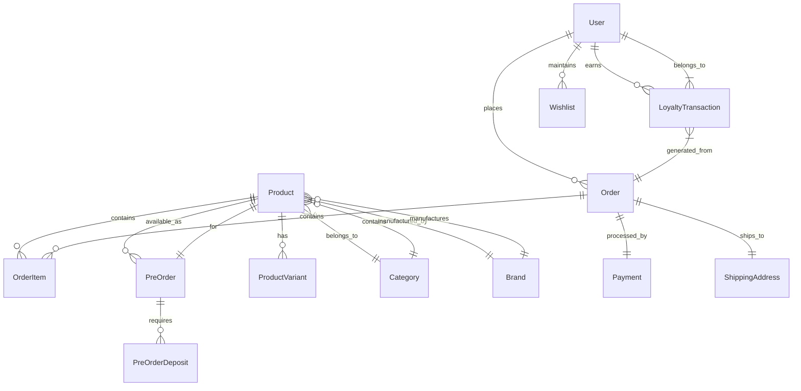

# Design Document: Diecast Empire E-commerce Platform

## Overview

Diecast Empire is a specialized e-commerce platform designed specifically for scale model collectors and the diecast hobby market. The system addresses unique challenges in the collectibles space including complex product categorization, pre-order management with deposit systems, loyalty rewards, and high-traffic event handling during product drops.

### Key Design Goals

- **Specialized Catalog Management**: Support for 10,000+ SKUs with complex filtering by scale, material, features, and chase variants
- **Pre-order Engine**: Robust system for managing future releases with deposit/full payment options
- **Performance Optimization**: Handle 100-500 concurrent users during Drop Day events
- **Loyalty Integration**: Comprehensive Diecast Credits system with transaction ledger
- **Administrative Control**: Advanced dashboard with analytics and multi-stage order management
- **Payment Security**: Secure integration with Philippine payment gateways (GCash, Maya, Bank Transfer)

### Technology Stack

- **Frontend**: React.js with modern state management and performance optimizations
- **Backend**: PHP/Laravel framework with RESTful API architecture
- **Database**: MySQL with optimized indexing for complex queries
- **Caching**: Redis for session management and frequently accessed data
- **CDN**: Content delivery network for product images and static assets
- **Payment Processing**: Secure integration with local Philippine payment gateways

## Architecture

### System Architecture Overview

The Diecast Empire platform follows a modern three-tier architecture with clear separation of concerns:



### Microservices Architecture

The backend is organized into focused services that can scale independently:

1. **Catalog Service**: Product management, search, and filtering
2. **Pre-order Engine**: Future release management and deposit handling
3. **Loyalty Service**: Diecast Credits earning, redemption, and ledger management
4. **Payment Service**: Gateway integration and transaction processing
5. **User Management**: Authentication, profiles, and preferences
6. **Order Management**: Cart, checkout, and fulfillment workflows
7. **Admin Service**: Dashboard, analytics, and administrative functions

### Performance Architecture

To handle Drop Day traffic spikes and maintain sub-2-second load times:

- **Database Read Replicas**: Distribute read queries across multiple MySQL instances
- **Redis Caching**: Cache frequently accessed product data, user sessions, and search results
- **CDN Integration**: Serve product images and static assets from edge locations
- **Database Indexing**: Optimized indexes for complex filtering queries
- **Connection Pooling**: Efficient database connection management
- **Horizontal Scaling**: Load balancer with multiple application server instances

## Components and Interfaces

### Frontend Components

#### Product Catalog Interface
- **Advanced Filtering System**: Multi-dimensional filters for Scale, Material, Features, Chase variants
- **Search Functionality**: Full-text search with autocomplete and suggestions
- **Product Grid/List Views**: Responsive layouts with lazy loading for performance
- **Product Detail Pages**: Comprehensive product information with image galleries
- **Wishlist Management**: Save and organize desired products

#### Pre-order Management Interface
- **Pre-order Listings**: Clear indication of availability dates and deposit requirements
- **Deposit Payment Flow**: Streamlined checkout for partial payments
- **Pre-order Tracking**: Status updates and arrival notifications
- **Payment Completion**: Automated reminders and easy payment completion

#### Loyalty System Interface
- **Credits Dashboard**: Real-time balance and transaction history
- **Earning Tracker**: Visual progress toward next reward tier
- **Redemption Interface**: Apply credits during checkout with clear value display
- **Tier Benefits**: Display current tier status and benefits

#### User Account Interface
- **Profile Management**: Personal information and preferences
- **Order History**: Complete purchase history with tracking information
- **Address Book**: Multiple shipping addresses with default selection
- **Payment Methods**: Saved payment preferences and security settings

### Backend API Interfaces

#### Catalog API
```php
// Product search and filtering
GET /api/products?scale=1:64&material=diecast&features=opening_doors
POST /api/products/search
GET /api/products/{id}
GET /api/categories
GET /api/filters
```

#### Pre-order API
```php
// Pre-order management
GET /api/preorders
POST /api/preorders/{id}/deposit
POST /api/preorders/{id}/complete-payment
GET /api/preorders/{id}/status
```

#### Loyalty API
```php
// Diecast Credits management
GET /api/loyalty/balance
GET /api/loyalty/transactions
POST /api/loyalty/redeem
GET /api/loyalty/tier-status
```

#### Payment API
```php
// Payment processing
POST /api/payments/gcash
POST /api/payments/maya
POST /api/payments/bank-transfer
GET /api/payments/{id}/status
POST /api/payments/{id}/verify
```

### Admin Dashboard Components

#### Analytics Dashboard
- **Sales Metrics**: Revenue, order volume, and conversion rates
- **Product Performance**: Best sellers, slow movers, and inventory turnover
- **Customer Analytics**: User behavior, retention, and loyalty metrics
- **Traffic Analysis**: Page views, bounce rates, and performance metrics

#### Order Management System
- **Multi-stage Workflow**: Order processing, fulfillment, and shipping stages
- **Bulk Operations**: Process multiple orders efficiently
- **Exception Handling**: Manage payment failures, inventory issues, and customer requests
- **Shipping Integration**: Label generation and tracking updates

#### Inventory Management
- **Stock Tracking**: Real-time inventory levels with low-stock alerts
- **Pre-order Management**: Arrival tracking and customer notifications
- **Supplier Integration**: Purchase orders and receiving workflows
- **Chase Variant Tracking**: Special handling for limited edition items

## Data Models

### Core Entity Relationships



### Database Schema

#### Products Table
```sql
CREATE TABLE products (
    id BIGINT PRIMARY KEY AUTO_INCREMENT,
    sku VARCHAR(50) UNIQUE NOT NULL,
    name VARCHAR(255) NOT NULL,
    description TEXT,
    brand_id BIGINT,
    category_id BIGINT,
    scale VARCHAR(20),
    material VARCHAR(50),
    features JSON,
    is_chase_variant BOOLEAN DEFAULT FALSE,
    base_price DECIMAL(10,2),
    current_price DECIMAL(10,2),
    stock_quantity INT DEFAULT 0,
    is_preorder BOOLEAN DEFAULT FALSE,
    preorder_date DATE NULL,
    status ENUM('active', 'inactive', 'discontinued'),
    images JSON,
    specifications JSON,
    created_at TIMESTAMP DEFAULT CURRENT_TIMESTAMP,
    updated_at TIMESTAMP DEFAULT CURRENT_TIMESTAMP ON UPDATE CURRENT_TIMESTAMP,
    
    INDEX idx_brand_category (brand_id, category_id),
    INDEX idx_scale_material (scale, material),
    INDEX idx_preorder (is_preorder, preorder_date),
    INDEX idx_chase_variant (is_chase_variant),
    INDEX idx_status_stock (status, stock_quantity),
    FULLTEXT idx_search (name, description)
);
```

#### Users Table
```sql
CREATE TABLE users (
    id BIGINT PRIMARY KEY AUTO_INCREMENT,
    email VARCHAR(255) UNIQUE NOT NULL,
    password_hash VARCHAR(255) NOT NULL,
    first_name VARCHAR(100),
    last_name VARCHAR(100),
    phone VARCHAR(20),
    date_of_birth DATE,
    loyalty_tier ENUM('bronze', 'silver', 'gold', 'platinum') DEFAULT 'bronze',
    loyalty_credits DECIMAL(10,2) DEFAULT 0.00,
    total_spent DECIMAL(12,2) DEFAULT 0.00,
    email_verified_at TIMESTAMP NULL,
    phone_verified_at TIMESTAMP NULL,
    status ENUM('active', 'inactive', 'suspended') DEFAULT 'active',
    preferences JSON,
    created_at TIMESTAMP DEFAULT CURRENT_TIMESTAMP,
    updated_at TIMESTAMP DEFAULT CURRENT_TIMESTAMP ON UPDATE CURRENT_TIMESTAMP,
    
    INDEX idx_email (email),
    INDEX idx_loyalty_tier (loyalty_tier),
    INDEX idx_status (status)
);
```

#### Orders Table
```sql
CREATE TABLE orders (
    id BIGINT PRIMARY KEY AUTO_INCREMENT,
    order_number VARCHAR(50) UNIQUE NOT NULL,
    user_id BIGINT NOT NULL,
    status ENUM('pending', 'confirmed', 'processing', 'shipped', 'delivered', 'cancelled') DEFAULT 'pending',
    subtotal DECIMAL(10,2) NOT NULL,
    credits_used DECIMAL(10,2) DEFAULT 0.00,
    discount_amount DECIMAL(10,2) DEFAULT 0.00,
    shipping_fee DECIMAL(8,2) DEFAULT 0.00,
    total_amount DECIMAL(10,2) NOT NULL,
    payment_method VARCHAR(50),
    payment_status ENUM('pending', 'paid', 'failed', 'refunded') DEFAULT 'pending',
    shipping_address JSON NOT NULL,
    notes TEXT,
    created_at TIMESTAMP DEFAULT CURRENT_TIMESTAMP,
    updated_at TIMESTAMP DEFAULT CURRENT_TIMESTAMP ON UPDATE CURRENT_TIMESTAMP,
    
    INDEX idx_user_status (user_id, status),
    INDEX idx_order_number (order_number),
    INDEX idx_payment_status (payment_status),
    INDEX idx_created_date (created_at)
);
```

#### Pre-orders Table
```sql
CREATE TABLE preorders (
    id BIGINT PRIMARY KEY AUTO_INCREMENT,
    product_id BIGINT NOT NULL,
    user_id BIGINT NOT NULL,
    quantity INT NOT NULL DEFAULT 1,
    deposit_amount DECIMAL(8,2) NOT NULL,
    remaining_amount DECIMAL(8,2) NOT NULL,
    deposit_paid_at TIMESTAMP NULL,
    full_payment_due_date DATE,
    status ENUM('deposit_pending', 'deposit_paid', 'ready_for_payment', 'completed', 'cancelled') DEFAULT 'deposit_pending',
    estimated_arrival_date DATE,
    actual_arrival_date DATE NULL,
    notes TEXT,
    created_at TIMESTAMP DEFAULT CURRENT_TIMESTAMP,
    updated_at TIMESTAMP DEFAULT CURRENT_TIMESTAMP ON UPDATE CURRENT_TIMESTAMP,
    
    INDEX idx_user_status (user_id, status),
    INDEX idx_product_status (product_id, status),
    INDEX idx_arrival_date (estimated_arrival_date),
    INDEX idx_payment_due (full_payment_due_date)
);
```

#### Loyalty Transactions Table
```sql
CREATE TABLE loyalty_transactions (
    id BIGINT PRIMARY KEY AUTO_INCREMENT,
    user_id BIGINT NOT NULL,
    order_id BIGINT NULL,
    transaction_type ENUM('earned', 'redeemed', 'expired', 'bonus', 'adjustment') NOT NULL,
    amount DECIMAL(8,2) NOT NULL,
    balance_after DECIMAL(10,2) NOT NULL,
    description VARCHAR(255),
    reference_id VARCHAR(100),
    expires_at TIMESTAMP NULL,
    created_at TIMESTAMP DEFAULT CURRENT_TIMESTAMP,
    
    INDEX idx_user_type (user_id, transaction_type),
    INDEX idx_order_reference (order_id),
    INDEX idx_expiration (expires_at),
    INDEX idx_created_date (created_at)
);
```

### Data Relationships and Constraints

#### Referential Integrity
- Products must belong to valid categories and brands
- Orders must reference valid users and contain valid products
- Pre-orders must reference valid products and users
- Loyalty transactions must reference valid users

#### Business Rules
- Chase variants have limited quantities and special pricing
- Pre-orders require deposit before full payment
- Loyalty credits expire after 12 months of inactivity
- Users advance loyalty tiers based on total spending thresholds

#### Data Validation
- SKUs must be unique across all products
- Email addresses must be unique and properly formatted
- Phone numbers must follow Philippine format standards
- Prices must be positive decimal values
- Stock quantities cannot be negative

## Correctness Properties

*A property is a characteristic or behavior that should hold true across all valid executions of a system-essentially, a formal statement about what the system should do. Properties serve as the bridge between human-readable specifications and machine-verifiable correctness guarantees.*

### Property 1: Product Filtering Accuracy

*For any* product catalog and any combination of filters (Scale, Material, Features, Chase variants), all returned products should match every applied filter criterion exactly.

**Validates: Requirements 1.1, 1.8**

### Property 2: Pre-order Payment Flow Integrity

*For any* pre-order transaction, the sum of deposit amount and remaining amount should always equal the total product price, and payment status transitions should follow the defined workflow (deposit_pending → deposit_paid → ready_for_payment → completed).

**Validates: Requirements 1.3**

### Property 3: Loyalty Credits Ledger Accuracy

*For any* user account, the current loyalty credits balance should always equal the sum of all earned credits minus the sum of all redeemed credits minus any expired credits, maintaining perfect ledger integrity.

**Validates: Requirements 1.4**

### Property 4: Payment Gateway Transaction Integrity

*For any* payment transaction through GCash, Maya, or Bank Transfer, the system should maintain atomicity where either the payment completes successfully and order status updates, or the payment fails and no order state changes occur.

**Validates: Requirements 1.6**

### Property 5: User Authentication Security

*For any* authentication attempt, unauthorized users should be denied access to protected resources, and authenticated users should only access resources they own or have permission to view.

**Validates: Requirements 1.9**

### Property 6: Inventory Stock Consistency

*For any* inventory operation (purchase, reservation, restock, cancellation), the final stock quantity should accurately reflect all completed transactions, and stock should never become negative through normal operations.

**Validates: Requirements 1.10**

## Error Handling

### Frontend Error Handling

#### Network and API Errors
- **Connection Failures**: Graceful degradation with offline indicators and retry mechanisms
- **API Timeouts**: User-friendly timeout messages with manual retry options
- **Rate Limiting**: Automatic backoff and queue management for high-traffic periods
- **Validation Errors**: Real-time form validation with clear error messaging

#### Payment Processing Errors
- **Gateway Failures**: Fallback to alternative payment methods with clear error explanations
- **Insufficient Funds**: Clear messaging with suggestions for alternative payment amounts
- **Transaction Timeouts**: Automatic status checking and user notification systems
- **Duplicate Transactions**: Prevention mechanisms and duplicate detection

#### User Experience Errors
- **404 Product Pages**: Intelligent suggestions for similar or alternative products
- **Search No Results**: Suggested searches and popular product recommendations
- **Cart Errors**: Real-time inventory checking and alternative product suggestions
- **Session Expiry**: Graceful session extension and cart preservation

### Backend Error Handling

#### Database Errors
- **Connection Pool Exhaustion**: Automatic scaling and connection management
- **Query Timeouts**: Optimized queries with fallback to cached data
- **Deadlock Detection**: Automatic retry mechanisms with exponential backoff
- **Data Integrity Violations**: Comprehensive validation and rollback procedures

#### Payment Gateway Errors
- **API Failures**: Automatic retry with different gateways and failure notifications
- **Webhook Delays**: Polling mechanisms and manual verification procedures
- **Refund Processing**: Automated refund workflows with manual override capabilities
- **Currency Conversion**: Real-time rate updates with fallback to cached rates

#### System Integration Errors
- **Email Service Failures**: Queue-based retry system with alternative notification methods
- **SMS Gateway Issues**: Fallback to email notifications and admin alerts
- **CDN Failures**: Automatic failover to backup image servers
- **Cache Invalidation**: Graceful cache rebuilding without service interruption

### Monitoring and Alerting

#### Real-time Monitoring
- **Application Performance**: Response times, error rates, and throughput metrics
- **Database Health**: Connection counts, query performance, and replication lag
- **Payment Processing**: Transaction success rates and gateway response times
- **User Experience**: Page load times, conversion rates, and error frequencies

#### Alert Thresholds
- **Critical Alerts**: Payment failures, database outages, security breaches
- **Warning Alerts**: High error rates, slow response times, low inventory
- **Information Alerts**: Successful deployments, scheduled maintenance, traffic spikes

## Testing Strategy

### Dual Testing Approach

The Diecast Empire platform requires comprehensive testing through both unit tests and property-based tests to ensure correctness and reliability:

**Unit Tests**: Focus on specific examples, edge cases, and integration points
- Payment gateway integration scenarios
- User authentication workflows  
- Admin dashboard functionality verification
- Error handling for specific failure modes
- Database migration and schema validation

**Property Tests**: Verify universal properties across all possible inputs
- Product filtering accuracy across all filter combinations
- Loyalty credits ledger integrity for all transaction types
- Pre-order payment flow consistency for all scenarios
- Inventory stock tracking accuracy for all operations
- User authentication security for all access patterns

### Property-Based Testing Configuration

**Testing Framework**: PHPUnit with Eris property-based testing library for PHP backend, and fast-check for React frontend components

**Test Configuration**:
- Minimum 100 iterations per property test to ensure comprehensive input coverage
- Each property test tagged with design document reference
- Tag format: **Feature: diecast-empire, Property {number}: {property_text}**

**Property Test Implementation Requirements**:
- Property 1 test: **Feature: diecast-empire, Property 1: Product filtering accuracy**
- Property 2 test: **Feature: diecast-empire, Property 2: Pre-order payment flow integrity**  
- Property 3 test: **Feature: diecast-empire, Property 3: Loyalty credits ledger accuracy**
- Property 4 test: **Feature: diecast-empire, Property 4: Payment gateway transaction integrity**
- Property 5 test: **Feature: diecast-empire, Property 5: User authentication security**
- Property 6 test: **Feature: diecast-empire, Property 6: Inventory stock consistency**

### Testing Environments

#### Development Testing
- **Local Environment**: Full stack testing with Docker containers
- **Unit Test Coverage**: Minimum 80% code coverage for critical business logic
- **Integration Testing**: API endpoint testing with mock external services
- **Frontend Testing**: Component testing with React Testing Library

#### Staging Testing
- **Load Testing**: Simulate Drop Day traffic with 500 concurrent users
- **Payment Testing**: End-to-end testing with sandbox payment gateways
- **Performance Testing**: Verify sub-2-second load times under normal load
- **Security Testing**: Penetration testing and vulnerability scanning

#### Production Monitoring
- **Synthetic Testing**: Continuous monitoring of critical user journeys
- **A/B Testing**: Feature rollout testing with gradual user exposure
- **Performance Monitoring**: Real-time application performance monitoring
- **Error Tracking**: Comprehensive error logging and alerting systems

### Test Data Management

#### Test Data Generation
- **Product Catalog**: Generate diverse product datasets with all scale/material combinations
- **User Accounts**: Create test users across all loyalty tiers and account states
- **Transaction History**: Generate realistic purchase and loyalty transaction patterns
- **Pre-order Scenarios**: Create various pre-order states and payment combinations

#### Data Privacy and Security
- **Anonymized Production Data**: Use anonymized production data for realistic testing
- **PII Protection**: Ensure no real customer data in test environments
- **Payment Security**: Use only sandbox/test payment credentials
- **Data Cleanup**: Automated cleanup of test data after test completion